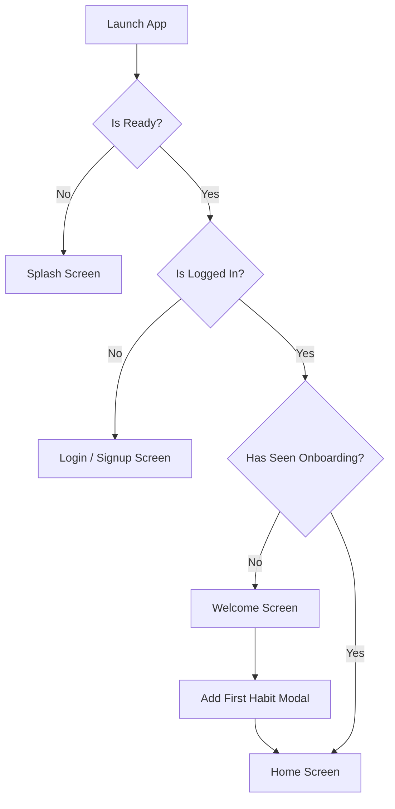

# Application Flow Document

## 1. High-Level User Journey
The ZenHabit application is structured to minimize friction between launching the app and logging a habit.

## 2. App State Flow

## 3. Screen Navigation
### 3.1. Main Navigation (Bottom Tab Bar)
- **Home**: The core screen displaying the daily checklist and weekly calendar view.
- **Stats**: A detailed breakdown of habit completion rates, best streaks, and historical data.
- **Settings**: User profile management, theme selection, data export, and logout options.

### 3.2. Action Flows
- **Adding a Habit**: Tapping the central '+' button on the Bottom Tab Bar opens the `AddHabitModal`. Users select a name, goal type (Build/Break), and an icon.
- **Checking Off a Habit**: Tapping a `HabitCard` on the Home screen immediately toggles its completion state.
- **Deep Linking**: Tapping a home screen widget directly triggers the `zenHabitWidget://checkoff/:id` deep link, logging the habit without navigating through the UI.

## 4. Edge Cases & Fallbacks
- **Offline State**: If the device loses internet connection, the app remains fully functional. Cloud sync is deferred until the connection is restored.
- **Guest Access**: Users can skip login to use the app locally. A prompt in settings allows them to create an account later and sync their local data to the cloud.
