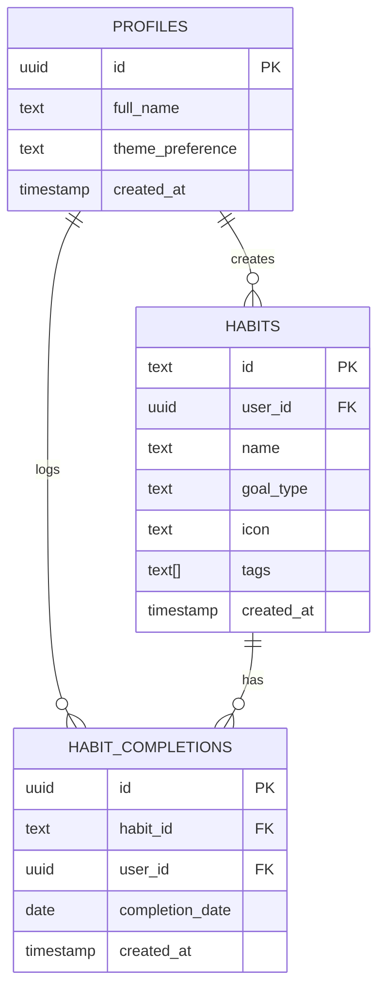

# Backend Schema & Database Architecture

## 1. Overview
The backend is built on Supabase, utilizing PostgreSQL. It relies heavily on Row Level Security (RLS) to enforce data privacy and security directly at the database layer.

## 2. Entity Relationship Diagram

## 3. Table Definitions

### 3.1. `profiles`
Stores user-specific metadata and preferences.
- `id` (UUID): Primary key, links to `auth.users.id`.
- `full_name` (TEXT): User's display name.
- `theme_preference` (TEXT): Defaults to 'system'.
- `created_at` (TIMESTAMP): Creation timestamp.

### 3.2. `habits`
Stores the definitions of habits created by users.
- `id` (TEXT): String-based unique identifier generated by the client (e.g., `habit-123456`).
- `user_id` (UUID): Foreign key to `auth.users`.
- `name` (TEXT): Habit display name.
- `goal_type` (TEXT): Either 'build' or 'break'.
- `icon` (TEXT): Lucide icon identifier.
- `tags` (TEXT[]): Array of classification tags.

### 3.3. `habit_completions`
Records individual check-ins for habits.
- `id` (UUID): Auto-generated unique identifier.
- `habit_id` (TEXT): Foreign key to `habits.id`.
- `user_id` (UUID): Foreign key to `auth.users`.
- `completion_date` (DATE): The calendar date the habit was completed.
- *Constraint*: `UNIQUE(habit_id, user_id, completion_date)` prevents duplicate check-ins for the same day.

## 4. Row Level Security (RLS)
All tables have RLS enabled. Policies ensure that:
- Users can only `SELECT`, `INSERT`, `UPDATE`, and `DELETE` rows where `user_id` matches their authenticated `auth.uid()`.
